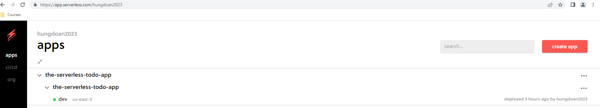
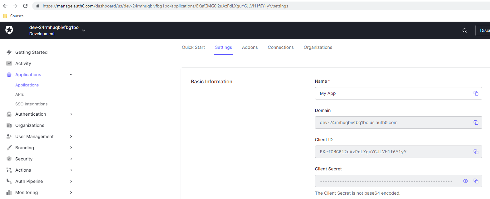
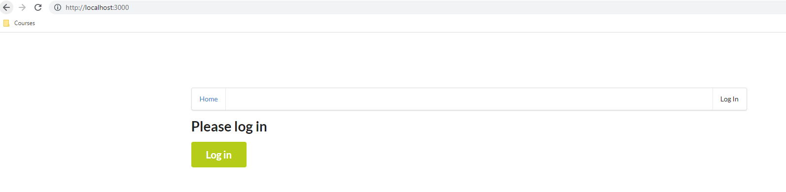
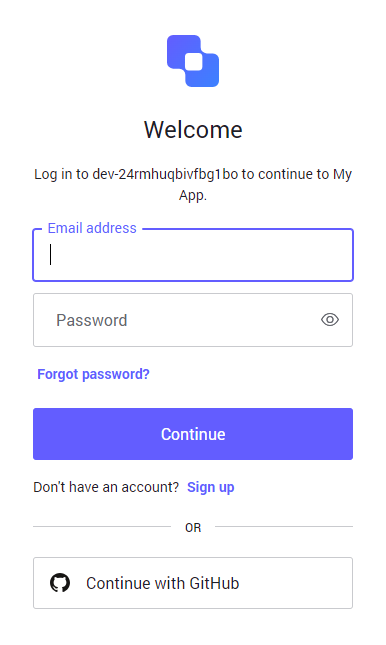
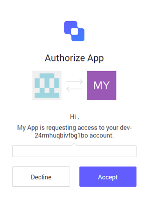
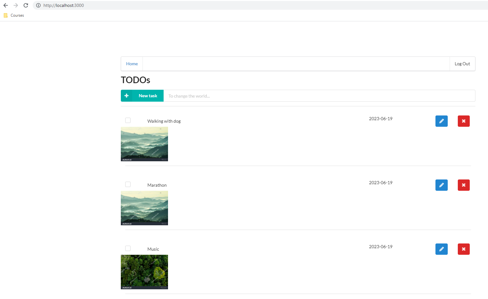

# Project overview
In this project you will develop and deploy a simple "TODO" application using AWS Lambda and Serverless framework. This application will allow users to create/remove/update/get TODO items. Each TODO item contains the following fields:

* `todoId (string)` - a unique id for an item
* `createdAt (string)` - date and time when an item was created
* `name (string)` - name of a TODO item (e.g. "Change a light bulb")
* `dueDate (string)` - date and time by which an item should be completed
* `done (boolean)` - true if an item was completed, false otherwise
* `attachmentUrl (string)` (optional) - a URL pointing to an image attached to a TODO item

Notes: This project was bootstrapped with [Create React App](https://github.com/facebook/create-react-app).

## Steps to Customize and Development

In the project directory, you can run:
Use command line to jump into the `backend` directory and run
### Setting environment Backend and Frontend
#### Clone the repository
* [https://github.com/HungDoan2023/the-serverless-todo-app](https://github.com/HungDoan2023/the-serverless-todo-app)

#### Create an Serverless application and Fetch a Certificate with Auth0
1. Create a Serverless application
* 

2. Create account on Auth0 for fetching certificate
* 

#### Backend
* `npm install -g --force`
* `npm audix fix --force`
* `npm install serverless --force`
* `sls config credentials --provider aws --key <key value> --secret <secret value> --aws-profile serverless`
* `serverless deploy --aws-profile serverless`

#### Frontend
* `npm install -g --force`
* `npm run build`
* `npm run start`

#### Demo
* Runs the app in with access [http://localhost:3000](http://localhost:3000) to view it in the browser.

* You will see some pages as screentshot below
1. Login form request login credential information

2. After you click Login button, a popup request enter account information and request Accept like this
* Request login popup

* Authorize login popup

3. The TODO list page will happen

4. Here, you can create a new task, update the task, even though you can delete the task.

#### Thanks you
Thanks for the AWS Cloud Developer course and trainers and supporter so I'm able to get more knowledge about AWS and a lot of technical skill such as: ReactJs, NodeJs. It made me become a stronger, confident and understanding developer

